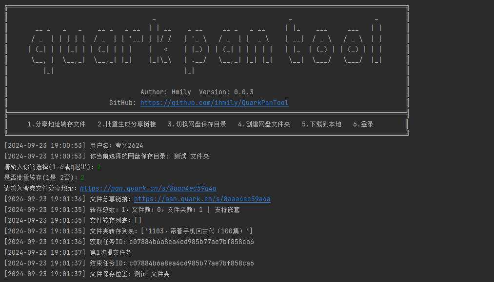

# QuarkPanTool

[](https://www.python.org/downloads/release/python-3116/)
[](https://github.com/ihmily/QuarkPanTool/releases/latest)
[](https://github.com/ihmily/QuarkPanTool/releases/latest)


QuarkPanTool 是一个简单易用的小工具，旨在帮助用户快速批量转存分享文件、批量生成分享链接和批量下载夸克网盘文件。

## 功能特点

- 运行稳定：基于playwright支持网页登录夸克网盘，无需手动获取Cookie。
- 轻松操作：简洁直观的命令行界面，方便快捷地完成文件转存。
- 批量转存：支持一次性转存多个夸克网盘分享链接中的文件。
- 批量分享：支持一次性将某个文件夹内的所有文件夹批量生成分享链接，无需手动分享文件。
- 本地下载：支持批量下载网盘文件夹中的文件，已绕过web端文件大小下载限制，无需VIP。
- **API模式**：提供REST API接口，支持程序化操作网盘，包括生成分享链接、转存文件、检查链接有效性、列出文件等功能。
- **邮件通知**：Cookie过期时自动发送邮件提醒。

## 如何使用

如果不想自己部署环境，可以下载打包好的可执行文件(exe)压缩包 [QuarkPanTool](https://github.com/ihmily/QuarkPanTool/releases) ，解压后直接运行即可。

1.下载代码

```
git clone https://github.com/ihmily/QuarkPanTool.git
```

2.安装依赖

```
pip install -r requirements.txt
playwright install firefox
```

3.运行

```
python quark.py
```

运行后会使用playwright进行登录操作，当然也可以自己手动获取cookie填写到config/cookies.txt文件中。更多说明请浏览 [wiki](https://github.com/ihmily/QuarkPanTool/wiki) 页面

## API模式使用

QuarkPanTool 支持以API服务方式运行，提供REST API接口供其他程序调用。

### 启动API服务

```bash
# 使用默认端口 13000
python quark_api.py --api

# 或指定自定义端口
python quark_api.py --api --port 8080
```

### 配置邮件通知

编辑 `config.py` 文件，配置Gmail邮件通知（Cookie过期时自动提醒）：

```python
EMAIL_CONFIG = {
    'sender_email': 'your_email@gmail.com',
    'sender_password': 'your_app_password',  # Gmail应用专用密码
    'recipient_email': 'libertygm@gmail.com',
    'enabled': True
}
```

### API接口

- `POST /api/generate_sharelink` - 生成分享链接
- `POST /api/save_share` - 转存分享文件
- `POST /api/check_sharelink` - 检查分享链接有效性
- `POST /api/list_sharelink` - 列出分享文件列表
- `GET /api/health` - 健康检查

详细的API文档请查看 [API_DOCUMENTATION.md](./API_DOCUMENTATION.md)

## 注意事项

- 首次运行会比较缓慢，请注意底部任务栏，程序会自动打开一个浏览器，让你登录夸克网盘，登录完成后，请不要手动关闭浏览器，回到软件界面按Enter键，浏览器会自动关闭并保存你的登录信息，下次运行就不需要登录了。（如果是Linux环境，请自行在网页获取Cookie后填入config/cookies.txt文件使用）
- 执行批量转存之前，请先在url.txt文件中填写网盘分享地址（一行一个）。
- **如果分享地址有密码**，则在地址末尾加上 `?pwd=提取码`，例如`https://pan.quark.cn/s/abcd`是文件分享地址，提取码是123456，则输入到程序的地址应该是`https://pan.quark.cn/s/abcd?pwd=123456`

## 效果演示



## 许可证

QuarkPanTool 使用 [Apache-2.0 license](https://github.com/ihmily/QuarkPanTool#Apache-2.0-1-ov-file) 许可证，详情请参阅 LICENSE 文件。

------

**免责声明**：本工具仅供学习和研究使用，请勿用于非法目的。由使用本工具引起的任何法律责任，与本工具作者无关。
